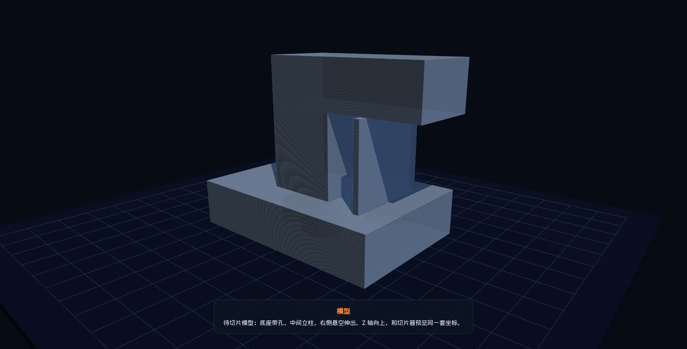
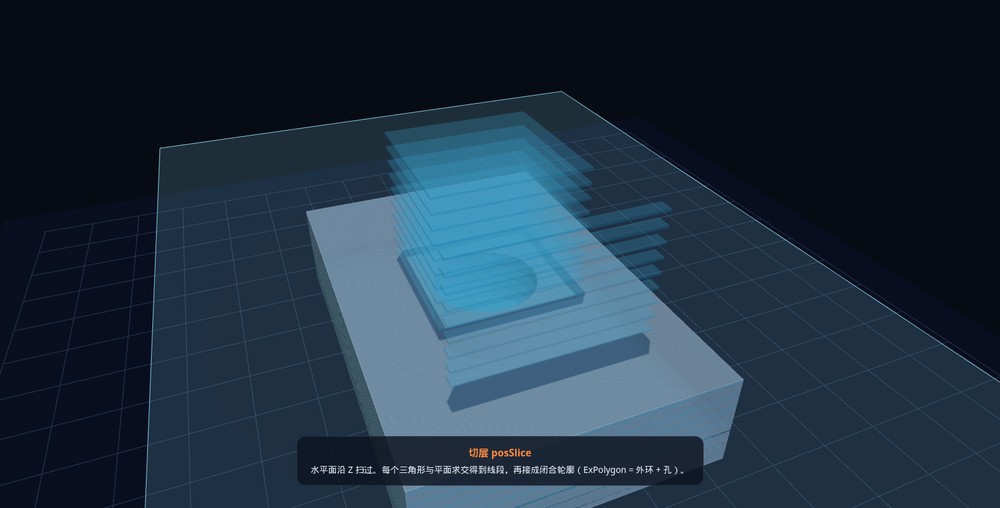
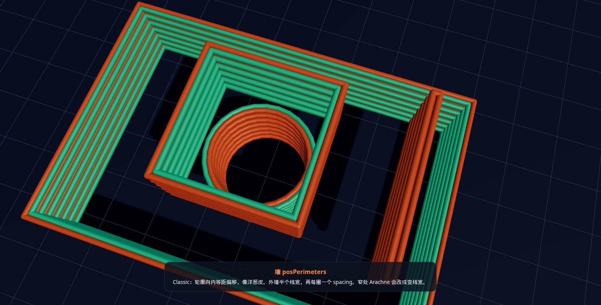
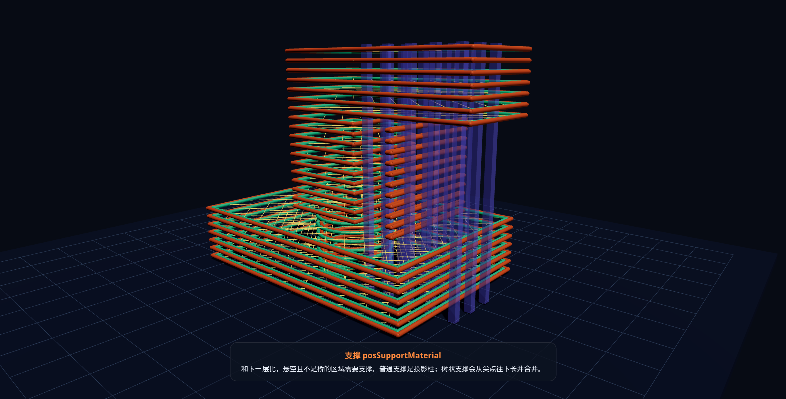
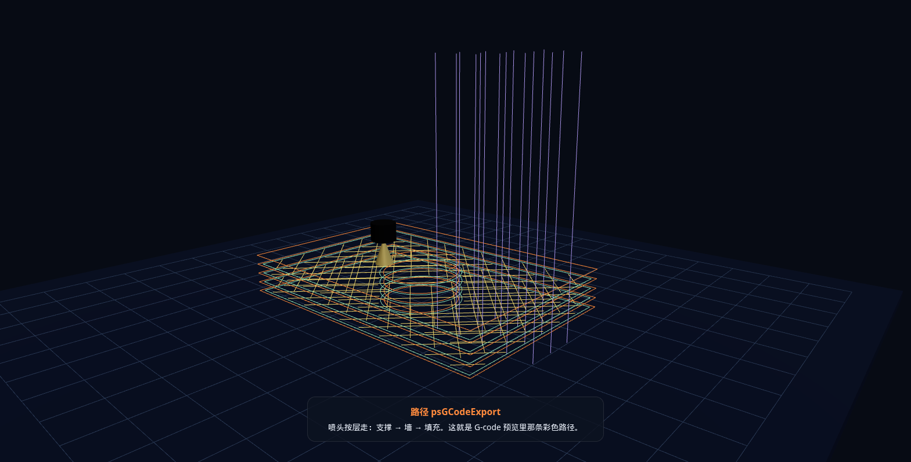

# 切片引擎 3D 演示

浏览器里播放的交互动画：切层、墙、填充、支撑、喷头路径。墙算法可在 Classic（洋葱皮）和 Arachne（窄处变线宽）之间切换。

右侧悬空的台阶模型用来讲支撑；底座圆孔用来讲 `ExPolygon`（外环 + 孔）；立柱旁有一条约 1mm 的窄肋，用来对比 Classic 塞两圈墙 vs Arachne 合成一圈变线宽。

## 怎么打开

在仓库根目录：

```bash
python3 -m http.server 8765
```

浏览器打开：

```
http://localhost:8765/docs/slicing-engine-demo/index.html
```

录制模式（隐藏控件、脚本相机）：

```
http://localhost:8765/docs/slicing-engine-demo/index.html?record=1
```

需要能访问 jsDelivr（加载 Three.js）。空格键播放/暂停，拖拽旋转，滚轮缩放。

## 动画在播什么

| 时间 | 步骤 | 画面 |
|---|---|---|
| 0–4s | 模型 | 带孔底座 + 立柱 + 右侧悬空 |
| 4–14s | `posSlice` | 切平面沿 Z 扫过，层片出现 |
| 14–18s | 层堆叠 | 2D 切片炸开，之后不再用三角网格 |
| 18–27s | `posPerimeters` | 外墙（橙）内墙（绿）向内偏移 |
| 27–33s | `posInfill` | 直线填充 clip 进剩余区域 |
| 33–39s | `posSupportMaterial` | 悬空下方竖柱支撑 |
| 39–52s | `psGCodeExport` | 喷头按支撑→墙→填充走路径 |

关键帧：






