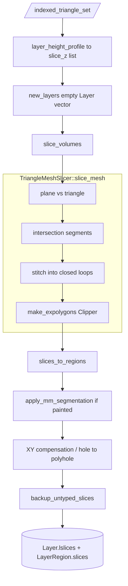
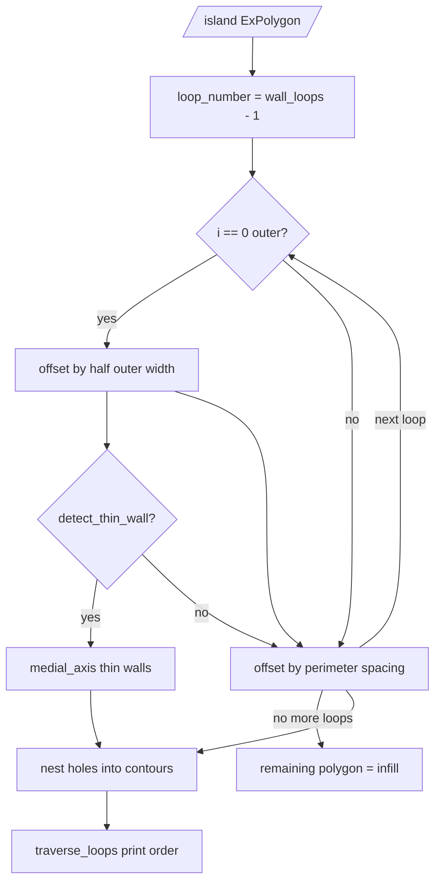
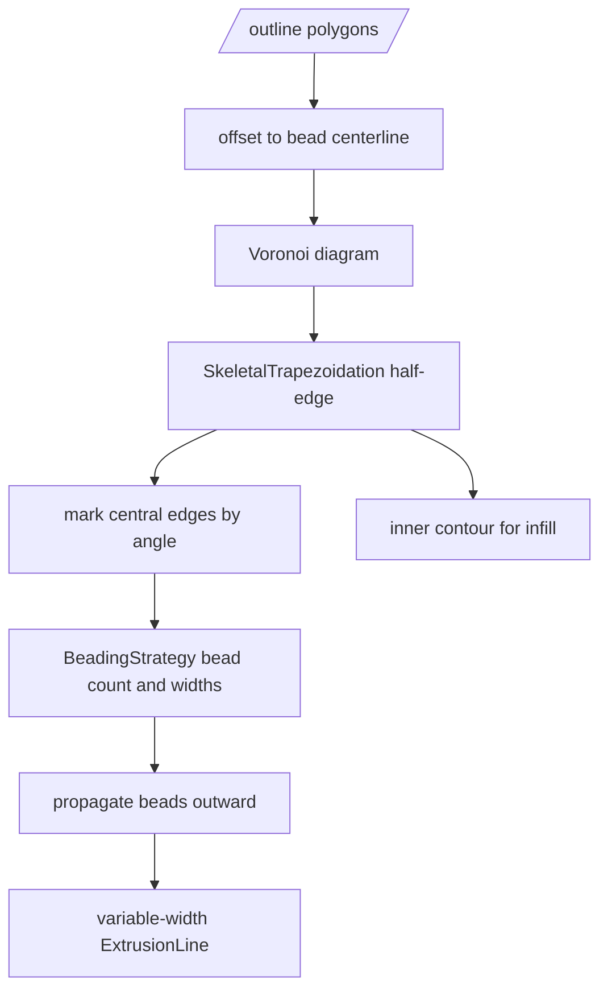
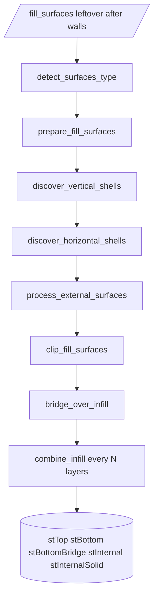
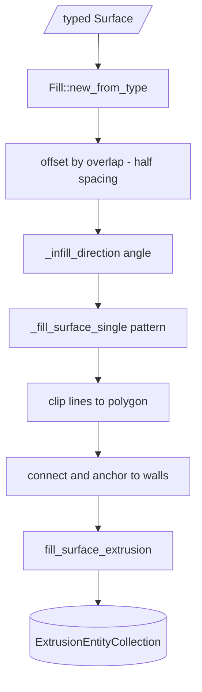
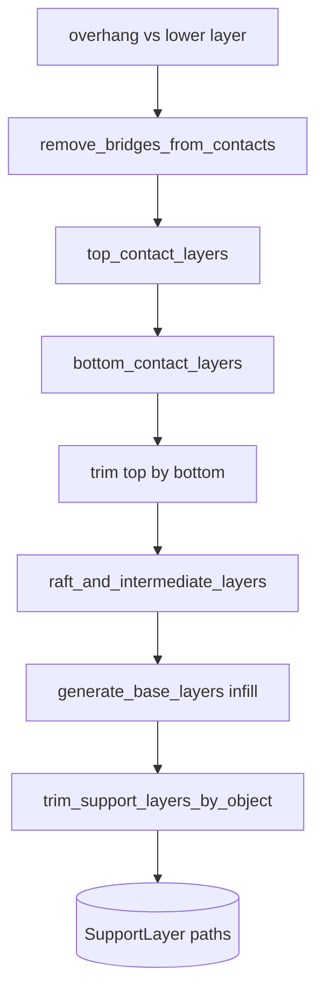
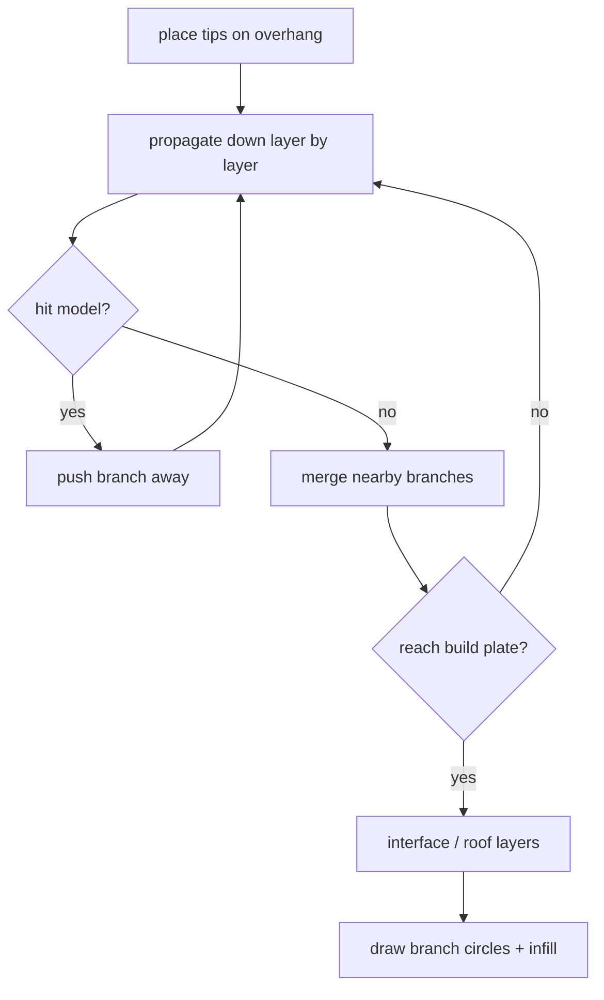
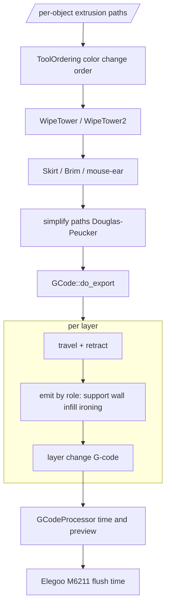

# 切片引擎算法可视化

先看 **3D 演示动画**（可交互，带时间轴）：

打开 [`docs/slicing-engine-demo/index.html`](slicing-engine-demo/index.html)（需本地静态服务，见该目录说明）。演示按真实切层几何播放：切平面扫过模型 → 层堆叠 → Classic/Arachne 墙 → 直线填充 → 悬空支撑 → 喷头走路径。

下面用流程图对照 `src/libslic3r/` 源码，把同一套算法拆开说明。

对照 `src/libslic3r/` 源码，把 FFF 切片从三角网格走到 G-code 的算法逻辑拆开画清楚。入口是 `Print::process()`（`Print.cpp`），每个物体走 `PrintObject` 上的分步状态机。

坐标约定：几何运算用整数微米（`coord_t`，缩放因子 `SCALING_FACTOR`），避免浮点误差。布尔运算走 Clipper。

---

## 1. 总流水线

先把模型切成一层层 2D 多边形，再在每层里长墙、填内部、加支撑，最后按层串成挤出路径并写成 G-code。

```mermaid
flowchart LR
    model[/Model mesh 3MF STL/]
    cfg{{PresetBundle machine filament process}}
    print[Print::process]

    subgraph perObject ["PrintObject per model"]
        direction TB
        s1[posSlice]
        s2[posPerimeters]
        s3[posEstimateCurledExtrusions]
        s4[posPrepareInfill]
        s5[posInfill]
        s6[posIroning]
        s7[posSupportMaterial]
        s8[posSimplifyPath]
        s1 --> s2 --> s3 --> s4 --> s5 --> s6 --> s7 --> s8
    end

    subgraph perPrint ["Print whole plate"]
        direction TB
        p1[psWipeTower]
        p2[psSkirtBrim]
        p3[psGCodeExport]
        p4[psConflictCheck]
        p1 --> p2 --> p3 --> p4
    end

    gcode[G-code file]
    preview[GCodeProcessor preview time]

    model --> print
    cfg --> print
    print --> s1
    s8 --> p1
    p4 --> gcode
    gcode --> preview
```



增量失效：改填充密度只会重跑 `posPrepareInfill` 之后的步骤；改层高会从 `posSlice` 重来。相同几何的多份物体会共享中间结果（`set_shared_object`）。

源码：`Print.hpp` 里的 `PrintStep` / `PrintObjectStep`；调度在 `Print::process()`。

---

## 2. 切层：3D mesh → 每层 ExPolygon

目标：在每个 `slice_z` 平面上，得到带孔的 2D 区域（外轮廓 + 内孔）。



直觉：

1. 三角形与水平面相交，得到线段。
2. 把线段首尾接成闭合环。
3. Clipper 按绕向判断外轮廓 / 孔，得到 `ExPolygon`。
4. 多体积、多颜色涂装再切一次，分到不同 `PrintRegion`。

源码：`PrintObject::slice()` → `slice_volumes()`（`PrintObjectSlice.cpp`）→ `slice_mesh_ex()`（`TriangleMeshSlicer.cpp`）。

一层在几何上长这样：

```
  外轮廓 contour
  ┌─────────────────┐
  │   ┌───────┐     │
  │   │  孔    │     │  ExPolygon = contour + holes
  │   └───────┘     │
  └─────────────────┘
         ↓ 这一层的 lslices
```

---

## 3. 墙：Classic 洋葱 vs Arachne 变线宽

`LayerRegion::make_perimeters()` 看 `wall_generator`：默认 Arachne；花瓶模式强制 Classic。

### 3.1 Classic：等距内缩（洋葱皮）

固定线宽，轮廓一次次往里 offset。

```
原始切片          第 0 圈外墙        第 1 圈内墙         剩余给填充
████████████      ░██████████░      ░░████████░░      ░░░██████░░░
████████████  →   ░██████████░  →   ░░████████░░  →   ░░░██████░░░
████████████      ░██████████░      ░░████████░░      ░░░██████░░░
```



关键细节（`PerimeterGenerator::process_classic()`）：

- 外墙先缩 **半个外墙宽度**，之后每圈缩一个 **spacing**（线宽减去重叠）。
- 窄到放不下两圈的岛会改用更细的外墙宽度。
- 悬空：当前圈和下一层切片比，喷嘴直径撑不住的部分标成 overhang。
- 圈之间按包含关系建成树，再按 Inner/Outer 或 Outer/Inner 遍历。

### 3.2 Arachne：骨架 + 变线宽

窄处变细、宽处加圈，避免 Classic 在尖角挤出过厚或漏缝。来自 Cura 论文 *adaptive width control of dense contour-parallel toolpaths*。



几何直觉：在轮廓上立一圈圆锥，交成一张“距离场表面”。脊线（skeleton）处高度 = 到边界的距离。策略把这段距离拆成若干挤出线宽；窄通道可能只放 1 圈细线，宽处放满 `wall_loops`。

`BeadingStrategy` 组合：

| 策略 | 作用 |
|---|---|
| Distributed | 把宽度分到各圈 |
| Redistribute | 过渡区平滑改圈数 |
| Limited | 圈数上限 |
| Widening | 太窄时加宽而不是丢掉 |
| OuterWallInset | Precise Wall：外墙微微内收 |

源码：`PerimeterGenerator::process_arachne()` → `Arachne::WallToolPaths::generate()` → `SkeletalTrapezoidation`。

---

## 4. 填充：先分类表面，再铺图案

墙只吃掉外壳。剩下的内部要先标成顶/底/桥/稀疏，再选图案画线。

### 4.1 表面分类 `prepare_infill`



和上下层做布尔，决定这块该实心还是稀疏：

```
     上一层有材料
          │
  ┌───────┴───────┐
  │ 本层切片       │
  │  顶面 = 本层有、上层没有
  │  底面 = 本层有、下层没有
  │  桥   = 底面且两端有支撑、中间悬空
  │  内部 = 上下都有 → 稀疏填充
  │  实心内部 = 靠近顶/底的 N 层壳
  └───────────────┘
          │
     下一层有材料
```

- `discover_vertical_shells`：斜面处补实心，保证竖直方向壳厚。
- `discover_horizontal_shells`：顶/底下再垫若干实心层。
- `process_external_surfaces`：顶/底外扩约 3mm 并检测桥。
- `combine_infill`：稀疏填充每隔 N 层合在一起打。

### 4.2 铺线 `Fill::fill_surface`



工厂按 `InfillPattern` 选实现：

| 类型 | 算法直觉 |
|---|---|
| Rectilinear / Monotonic / Aligned | 旋转后画平行线，再 clip 回多边形 |
| Grid / Triangles / Stars | 两组或多组平行线叠加 |
| Honeycomb | 六边形格子 |
| Gyroid / TPMS | 隐式曲面 `sin x cos y + … = 0` 的等值线 |
| Concentric | 再做一轮洋葱（可走 Arachne） |
| Lightning | 只在需要支撑上层的地方长树状筋 |
| Adaptive Cubic | 八叉树，细节密、内部疏 |

公共步骤（`FillBase.cpp`）：先把区域再缩半个线宽，按层号算填充角度，子类生成无线段，clip 后接到墙上（anchor），最后变成挤出实体。

---

## 5. 支撑：普通柱 vs 树

`PrintObject::_generate_support_material()`：`support_type` 是 tree 走 `TreeSupport`，否则走 `PrintObjectSupportMaterial`。

### 5.1 普通支撑

从上往下投影悬空区，中间用格子填满。



两端都搭在模型上的直边当成桥，从接触面里抠掉，避免给能打桥的地方加支撑。

### 5.2 树状支撑

悬空上插尖，一层层往下长，躲开模型，到热床或模型表面再合并。



源码：普通支撑 `Support/SupportMaterial.cpp`；树 `Support/TreeSupport.cpp`、`TreeSupport3D.cpp`。

---

## 6. 整盘收尾 → G-code

物体路径齐了之后，按整盘做擦料塔、裙边，再按层导出。



`GCodeProcessor` 再扫一遍写出的 G-code，估时间和预览。Centauri 换料是 `M6211`，走 `ElegooGCodeProcessorHelper` 的专用公式，不能当普通挤出算。

源码：`GCode::do_export()` → `_do_export()` → `process_layers()`；预览 `GCode/GCodeProcessor.cpp`。

---

## 7. 数据在层里怎么躺

```
Print
 └─ PrintObject[]          一个模型一份
     ├─ Layer[]            物体层
     │    ├─ lslices       该层总轮廓
     │    └─ LayerRegion[] 按材料/设置分区
     │         ├─ slices
     │         ├─ perimeters
     │         ├─ fills
     │         └─ thin_fills
     └─ SupportLayer[]
 └─ wipe tower / skirt / brim
```

每一步把结果写进这些容器。下一步只读上一份几何，所以状态机能跳过没失效的步骤。

---

## 8. 想对照代码时从哪读

| 想看懂 | 从这里进 |
|---|---|
| 步骤顺序、增量失效 | `Print.cpp` `Print::process()`，`Print.hpp` 的 enum |
| 切层 | `PrintObjectSlice.cpp`，`TriangleMeshSlicer.cpp` |
| Classic 墙 | `PerimeterGenerator::process_classic()` |
| Arachne 墙 | `PerimeterGenerator::process_arachne()`，`Arachne/WallToolPaths.cpp` |
| 表面分类 | `PrintObject::prepare_infill()` |
| 填充图案 | `Fill/FillBase.cpp`，`Fill/Fill*.cpp` |
| 普通 / 树支撑 | `Support/SupportMaterial.cpp`，`Support/TreeSupport.cpp` |
| G-code | `GCode.cpp`，`GCode/GCodeProcessor.cpp` |
